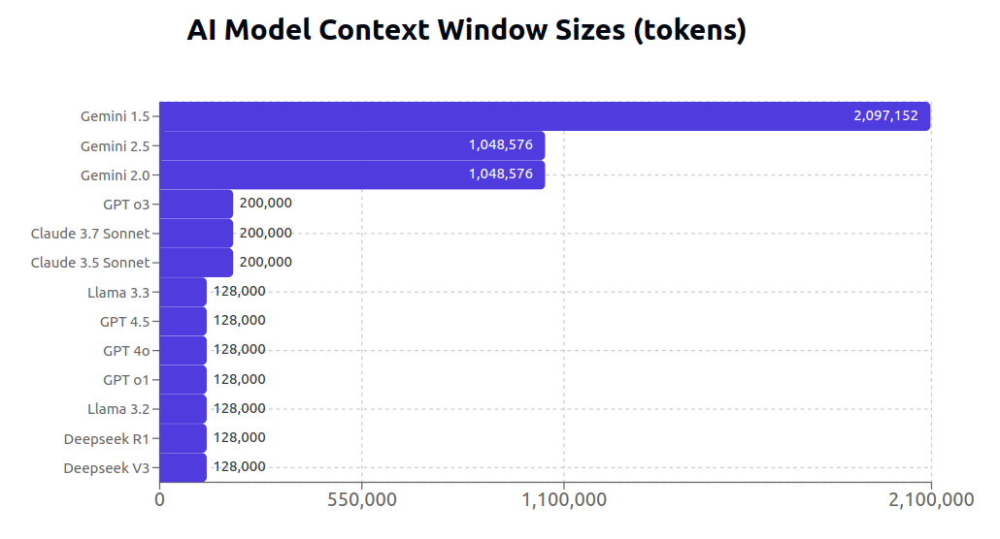

# Retrieval-Augmented Generation(RAG)
เป็นเทคนิคใน AI ที่ช่วยเพิ่มความแม่นยำและน่าเชื่อถือของโมเดลภาษาขนาดใหญ่ (LLM) โดยการดึงข้อมูลที่เกี่ยวข้องจากฐานความรู้ภายนอกมาเป็นบริบทเพิ่มเติม ทำเป็น prompt ให้โมเดลอ่านเพื่อสร้างคำตอบ 
ทำให้ AI สามารถให้คำตอบที่อิงจากข้อมูลจริง ล่าสุด และเฉพาะเจาะจงได้ดีขึ้น แทนที่จะต้องพึ่งพาข้อมูลที่ถูกฝึกไว้ในโมเดลเพียงอย่างเดียว. 
ข้อมูลมักจะเก็บในฐานข้อมูลประเถท Vector หรือ Graph ที่จะใช้การค้นหาจะใช้ความคล้ายของข้อมูลแทนการค้นหาแบบ keyword 

ในปัจจุบันความสำคัญของ RAG อาจจะลดลงเนื่องจาก LLM รองรับ context ขนาดใหญ่ได้ โดยเฉพาะ Gemini เอกสารที่ขนาดไม่ใหญ่นัก เราสามารถใส่ตรงๆให้ LLM ได้เลย ทำให้ใช้งานได้ยืดหยุ่นมากขึ้นโดยไม่ต้องทำ RAG

## Sample Code
- [simple_rag.ipynb](./simple_rag.ipynb) แบบง่ายด้วย Gemini
- [simple_rag_hybrid.ipynb](./simple_rag_hybrid.ipynb) ทำแบบ Hybrid Search ตัดคำ normalize Chunk

## Vectorization / Embeddings
เป็นขั้นตอนแปลงข้อมูลเป็นเวกเตอร์ตัวเลขที่มีมิติสูง เพื่อให้สามารถนำไปใช้ในงานต่างๆ เช่น การค้นหาความคล้ายคลึงกัน (similarity search) หรือการจัดกลุ่มข้อมูล (clustering) ได้ง่ายขึ้น 
การเลือกโมเดล ต้องขึ้นกับงานและต้องรองรับภาษาไทย ดูได้ที [Thai-Sentence-Vector-Benchmark](https://github.com/mrpeerat/Thai-Sentence-Vector-Benchmark) ที่นิยมใช้เช่น
- [BGE-M3](https://huggingface.co/BAAI/bge-m3) รองรับได้ถึง 8192 โทเคน
- [intfloat/multilingual-e5](https://huggingface.co/intfloat/multilingual-e5-large)
- [sentence-transformers/LaBSE](https://huggingface.co/sentence-transformers/LaBSE)
- wangchanberta ?

## การตัดข้อความ (Chunking)
เอกสารยิ่งใหญ่ยิ่งต้องใช้มิติขนาดใหญ่สำหรับเก็บ Vector จะกระทบกับประสิทธิ์ภาพของฐานข้อมูล 
และ Embeddings โมเดลจำมีข้อจำกัดเรื่องขนาดด้วย ดังนั้นจำเป็นต้องตัดข้อมูลเป็นส่วนเล็กๆ โดยที่ยังคงความหมายเดิมไว้ ถ้าไปตัดกึ่งกลางของบริบทก็จะเกิดปัญหาได้ ก็ต้องมีการทำ overlapping จุดที่ตัดสำหรับภาษาไทยจะยุ่งยากกว่าภาษาอังกฤษ เนื่องจากเป็นภาษาที่ไม่มีเครื่องหมายวรรคตอนชัดเจน วิธีที่การตัด:
- ตัดตาม จำนวนตัวอักษร/โทเคน (เช่น 300–500 tokens) ต้องมี overlapping
- หรือใช้การตัดตาม ประโยค/ย่อหน้า (sentence splitter ภาษาไทย)

น่าจะต้องศึกษาหัวข้อนี้ให้เข้าใจ อาจจะต้องศึกษาลักษณะของเอกสาร เพื่อกำหนดขนาดมิติ Chunking และ overlapping ที่เหมาะสม

## Database
ถ้าเลือกใช้ PostgreSQL หรือ Elasticsearch น่าจะปรับใช้กับงานได้ง่ายเพราะใช้กับระบบอื่นร่วมกันไม่ต้องติดตั้งตัวใหม่
- Vector Search: มีให้เลือกใช้หลายตัวเช่น [FAISS](https://github.com/facebookresearch/faiss),
[Weaviate](https://weaviate.io/), 
[Qdrant](https://qdrant.tech/), 
[PostgreSQL + pgvector](https://github.com/pgvector/pgvector)
- GraphRAG : ให้ผลที่ดีกว่า Vector แต่มีความซับซ้อนสูงกว่า เช่น [neo4j](https://neo4j.com/blog/developer/rag-tutorial/)
- Hybrid Search: ผสม BM25 (lexical) กับ embedding search → ภาษาไทย benefit มาก เพราะบางคำ embedding ไม่ชัด แต่ keyword ยังช่วยได้ เช่น  
[Elasticsearch hybrid search](https://www.elastic.co/what-is/hybrid-search)

## Generation
ในเบื้องต้น Gemini ในการทดสอบรองรับภาษาไทยได้ดี ส่วนนี้ถ้าปรับไปใช้ Node.js แทน Python ได้น่าจะง่ายในการ integrate กับระบบเดิม

## ปัญหา
- Word Segmentation: ภาษาไทยไม่มี space คั่นคำ ต้องใช้ตัวตัดคำ เช่น PyThaiNLP, Deepcut, หรือ HuggingFace tokenizer ที่รองรับไทย
- Normalization: ลดความหลากหลาย เช่น แปลงสระ/วรรณยุกต์ซ้ำ ("เก่งงงง" → "เก่ง"), การสะกดหลายแบบ (เช่น “กรุงเทพฯ” vs “กรุงเทพ”) → อาจพลาด retrieval, ภาษาพูด vs ภาษาเขียน → เช่น “ครับ/ค่ะ” อาจไม่จำเป็นต่อความหมาย แต่มีผลกับ similarity, การใช้ emoji หรือภาษาปนอังกฤษ → ต้อง normalize เพิ่ม
- Stopwords: ภาษาไทยมีคำฟุ่มเฟือย (เช่น "แล้ว", "และ", "คือ") ซึ่งอาจต้องกำจัดก่อน indexing
- Chunking การแบ่งตามหน้าหรือ ตามย่อหน้าน่าจะได้ใจความที่สมบูรณ์แล้ว แต่ก็อาจจะมีข้อความบางอย่าง อ้างถึงอีกย่อหน้าก่อนหน้า ถ้าไม่อ่านก่อนก็จะไม่มีข้อมูลที่สมบูรณ์ เช่น "จากสองหัวข้อที่แล้วเราก็เลยเลือวิธีการแบบนั้นไป ..." อาจจำเป็นต้องใช้ AI ช่วยเติม สรุปข้อมูลในการสร้าง Chunks ร่วมด้วย

## อ่านเพิ่ม
- [Embedding Projector](http://projector.tensorflow.org/)
- [breadchris/hybrid.py](https://gist.github.com/breadchris/b73aae81953eb8f865ebb4842a1c15b5)