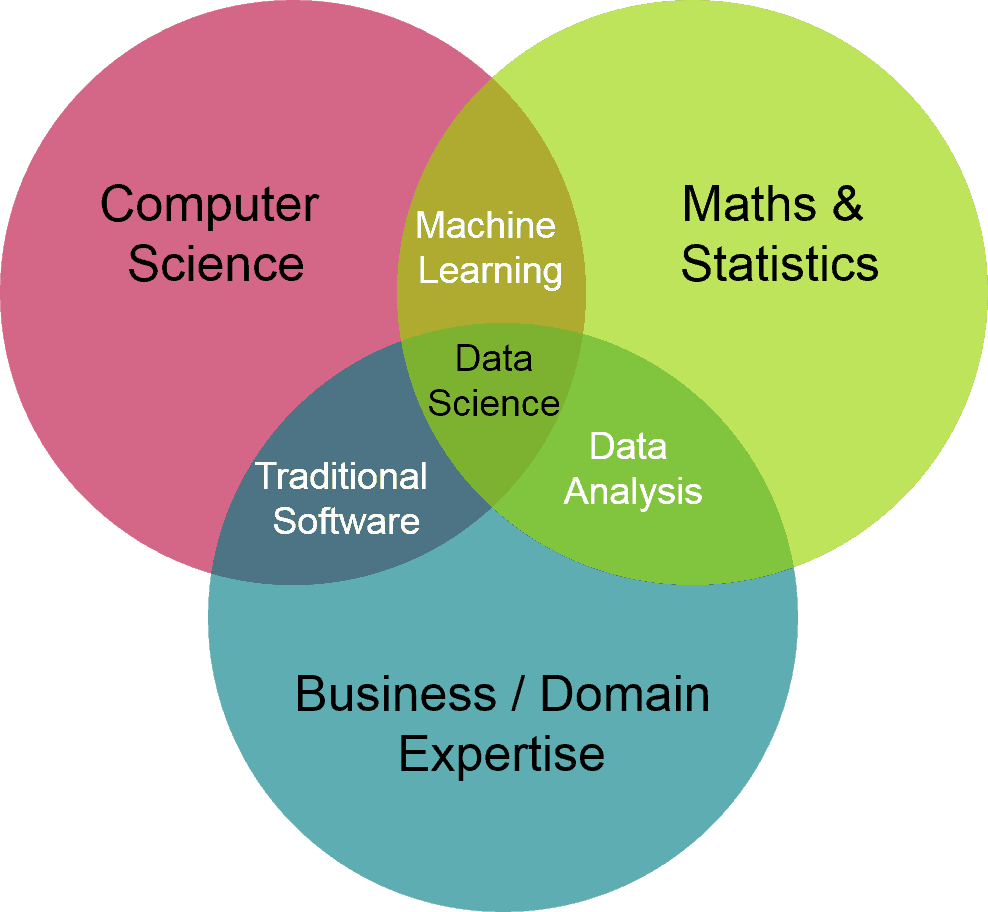
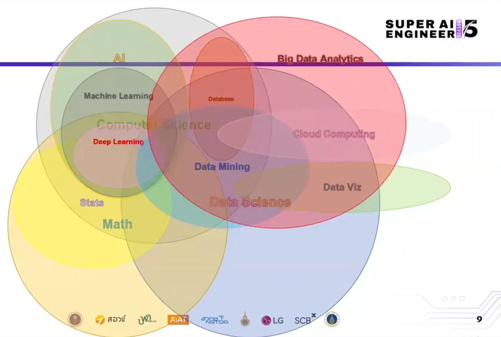

# AI
- เริ่มแรกจากมีข้อมูลมาทำสถิติเพื่อวิเคราะห์อดีตและทำนายแนวโน้มในอนาคต ทำเป็นโมเดลทางคณิตศาสตร์ 
- ข้อมูลแรกๆจะอยู่ในฐานข้อมูล csv หรือ Spread sheet
- ยุคอินเตอร์เน็ตมีข้อมูลมากมายก็จะมาทำ Data Mining
- เก็บข้อมูลใน Data lakehouse ทั้งแบบมีโครงสร้างและไม่มีโครงสร้าง
- Machine Learning(ML) เนื่องจากข้อมูลมีมาก ใช้การป้อนชุดข้อมูลที่ป้อนเข้าไปเพื่อเรียนรู้ ยังต้องอาศัยมนุษย์ปรับให้ผลแม่นยำ
- Deep Learning(DL) เป็นอีกแขนงที่แตกย่อยมาจาก ML สามารถตัดสินใจได้ด้วยตนเองว่าการคาดการณ์นั้นมีความแม่นยำหรือไม่ผ่าน Neural Network 

**วิทยาการข้อมูล**

เก็บ(Collect)→ จัดการ(Manage) →วิเคราะห์(Analyze)→ ตัดสินใจ(Decision)

**ตำแหน่งงานสายนี้**
- Data Engineer เซ็ตอัประบบ คลีนข้อมูล เขียนโปรแกรม ที่ควรรู้ - Database, Data Warehouse, Big Data Infrastructure, Cloud Computing, Programming
- Data Scientist ทำวิจัยเก่ง ใช้คณิตศาสตร์ระดับสูง สร้างโมเดลทำนายผล ด้วยข้อมูลที่คลีนแล้ว , ML, Deep Learning
- Data Analyst วิเคราะห์ขอมูลหาสิ่งที่ต้องการ Business Model, Statistics, Spreadsheet Tools, Data Visualization, SQL ใช้เครื่องมือพวก Excel Tableau, Power BI

Data Science = Computer science + Math & Static + Business / Domain Exertise

ในอีกมุม สำหรับ AI ที่เกี่ยวข้องกับสาขาต่างๆเป็นดังภาพ

## Machine Learning(ML)

- Supervised Learning เรียนรู้โดยมีคำตอบ(Target Attribute)ให้ มาสอนแบ่งเป็น Train และ Test เสมอ ผลวัดที่ความแม่นยำเป็นหลัก 
  - Regression ทำนายคำตอบที่เป็น continuous เช่นให้รูปภาพบุคคล เพื่อให้เครื่องทำนายอายุ
  - Classification ทำนายคำตอบที่เป็น discrete เช่นให้ภาพแล้วบอกว่าเป็นอะไร
- Unsupervised Learning เรียนรู้โดยไม่มีการสอนหรือคำตอบ(Target Attribute) ให้ เรามีเพียงชุดข้อมูลที่ประกอบไปด้วยคุณลักษณะเท่านั้นไม่มีคำตอบให้ โมเดลจะทำการเรียนรู้และจัดกลุ่มออกมาเอง ใช้เพื่อช่วยในการวิเคราะห์ ถูกจัดกว่าเป็นClustering
- Semi-Supervised Learning ผู้ปฏิบัติงานจะจัดเตรียมอัลกอริทึมที่มีทั้งชุดข้อมูลที่รู้จักและที่ไม่มีป้ายกำกับ ข้อมูลที่มีป้ายกำกับรวมถึงแท็กที่ช่วยให้อัลกอริทึมเข้าใจ ข้อมูลที่ไม่มีป้ายกำกับไม่มีแท็กหรือตัวระบุใดๆ ด้วยการวิเคราะห์ข้อมูลที่ติดแท็กและไม่ติดแท็ก อัลกอริทึม ML จึงสามารถเรียนรู้การประมวลผลข้อมูลที่ไม่มีโครงสร้างได้
- Reinforcement Learning (การเรียนรู้แบบเสริมกำลัง) เป็นการเรียนรู้แบบลองผิดลองถูก จะให้กรอบการทำงาน ผลที่ต้องการอาจจะเป็นรางวัล อัลกอริทึมจะลองวิธีการต่างๆจนกว่าจะให้ผลลัพธ์ที่ต้องการ

