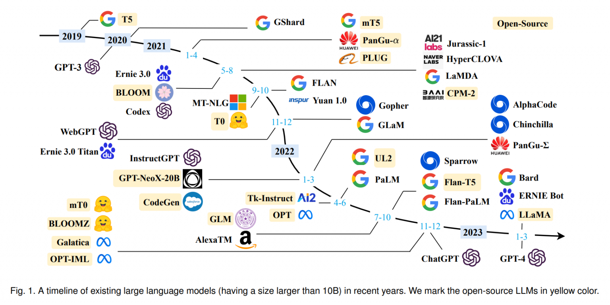
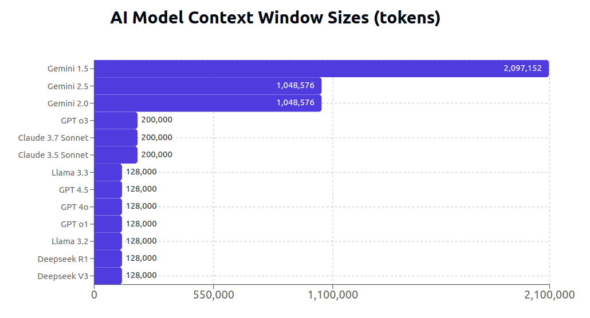

# Large Language Model(LLM)
แบบจำลองภาษาขนาดใหญ่ ถูกฝึกฝนจากชุดข้อมูลภาษาจำนวนมหาศาล ทำให้มีความสามารถในการเข้าใจและสร้างของมนุษย์ (ภาษาธรรมชาติ)ได้หลากหลายรูปแบบ เช่น การตอบคำถาม การแปลภาษา การสรุปข้อความ หรือการสร้างเนื้อหา 
โมเดลในปัจจุบันเป็น Multi-model ทำงานได้หลายอย่างเช่น รองรับตัวอักษรและไฟล์ภาพ

ในตัวอย่างจะใช้ Google Generative AI เป็นหลักแทน OpenAI เนื่องจากทีให้ทดสอบได้ฟรี
- [ตัวอย่างในภาษา Python](./python-example/Readme.md)
- [ตัวอย่างในภาษา JavaScript](./js-example/Readme.md)

TODO: ทำตัวอย่าง RAG, Langchain, Tool ฯลฯ

## Retrieval-Augmented Generation(RAG)
สามารถเพิ่มคลังความรู้เฉพาะทางเช่น ข้อมูลขององค์กร รายการสินค้า ฯลฯ ให้ LLM โดยที่ไม่ต้อง Train ใหม่ช่วยลดค่าใช้จ่าย และเหมาะกับข้อมูลที่มีการอัปเดตบ่อย โดยข้อมูลจะเก็บไว้ใน Vector Database 

ในปัจจุบันความสำคัญของ RAG อาจจะลดลงเนื่องจาก LLM รองรับ context ขนาดใหญ่ได้ โดยเฉพาะ Gemini เอกสารที่ขนาดไม่ใหญ่นัก เราสามารถใส่ตรงๆให้ LLM ได้เลย ทำให้ใช้งานได้ยืดหยุ่นมากขึ้นโดยไม่ต้องทำ RAG

