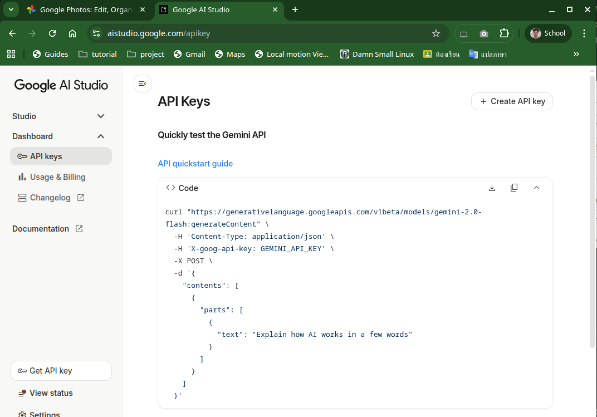

# Large Language Model(LLM)
แบบจำลองภาษาขนาดใหญ่ ถูกฝึกฝนจากชุดข้อมูลภาษาจำนวนมหาศาล ทำให้มีความสามารถในการเข้าใจและสร้างของมนุษย์ (ภาษาธรรมชาติ)ได้หลากหลายรูปแบบ เช่น การตอบคำถาม การแปลภาษา การสรุปข้อความ หรือการสร้างเนื้อหา 
โมเดลในปัจจุบันเป็น Multi-model ทำงานได้หลายอย่างเช่น รองรับตัวอักษรและไฟล์ภาพ

## Generative AI 
ในตัวอย่างจะใช้ Google Generative AI 
- [ตัวอย่างในภาษา Python](./python-example/Readme.md)
- [ตัวอย่างในภาษา JavaScript](./js-example/Readme.md)

สามารถของ [API Key](https://aistudio.google.com/apikey) ได้ฟรีจาก Google AI Studio กดตรงปุ่ม Create API key

## Retrieval-Augmented Generation(RAG)
โมเดล AI จะมีความรู้แบบทั่วๆไป เราสามารถเพิ่มคลังความรู้เฉพาะทางเช่น ข้อมูลขององค์กร รายการสินค้า ฯลฯ ให้ LLM โดยที่ไม่ต้อง Train ใหม่ช่วยลดค่าใช้จ่าย และเหมาะกับข้อมูลที่มีการอัปเดตบ่อย โดยข้อมูลจะเก็บไว้ใน Vector Database ทำการค้นหาแล้วนำมาให้ AI สรุปให้ฟังอีกทีดูตัวอย่างในหัวข้อ [RAG](../RAG/Readme.md)

