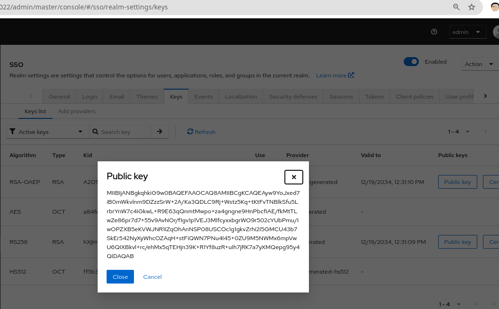
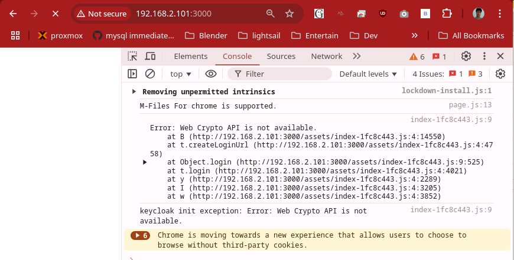
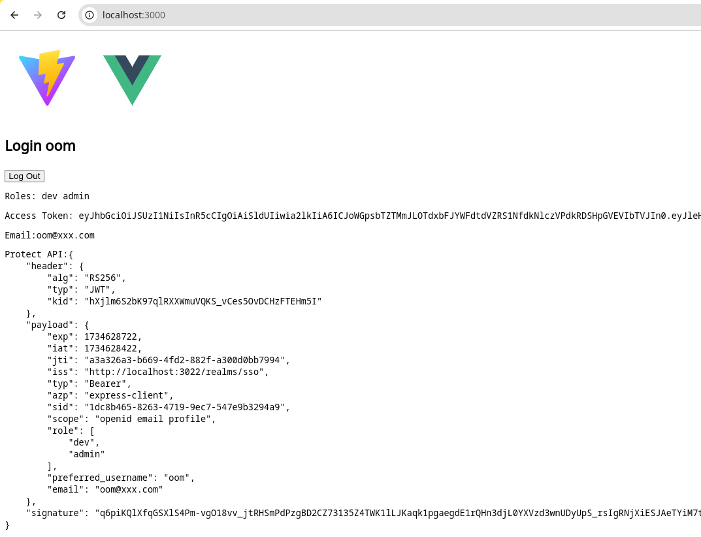

# Keycloak Vue Express
ตัวอย่างการใช้ Keycloak(26.0.6) ร่วมกับ Vue และ Express การตั้งค่าและใช้งาน Keycloak ดูที่ [Keyloak.md](./keycloak/Keycloak.md)

## Backend
Node.js + Express จะตรวจสอบ token ทำ Authorization ใช้ jsonwebtoken ในการตรวจสอบ
ให้สำเนา [.env.sample](./be/env.sample) ไปเป็น .env แล้วแก้ค่าให้เหมาะสม โค้ดจะเอา Public key มาเองแต่ถ้าต้องการดูค่าให้ไปที่หน้า Realms setting/Keys/RS256 กดปุ่ม Public Key

- [index.ts](./be/src/index.ts) เป็นโปรแกรมหลัก
- [auth.ts](./be/src/auth.ts) เป็น Express Middleware ใช้เพื่อตรวจสอบ และจัดการ Token 
  - initPublicKeyOnline(url) อ่าน Public Key จากเซิร์ฟเวอร์ keycloak แล้วเซ็ตในตัวแปร private ของโมดูล
  - initPublicKey(key) เซ็ต Private key ในตัวแปร private ของโมดูล 
  - verify() ตรวจสอบว่ายูสเซอร์ login หรือไม่ (มี token)
  - verifyOnline() จะเอา token จาก Frontend ไปตรวจสอบที่ ${REALM_URL}/protocol/openid-connect/userinfo สำหรับการทำงานทั่วไปควรหลีกเลี่ยงวิธีนี้ เพราะเสียเวลาเพิ่ม request ไปและกลับ ทุกๆการ request แต่น่าจะเหมาะกับความปลอดภัยสูงสุดสามารถตรวจสอบ token ที่โดน backlist ก่อนที่จะ refresh ใหม่
  - getDecodeToken(req: Request) ทำ decode โดยไม่ verify ทำจาก req เสมอไม่เก็บเป็นตัวแปรภายในเพื่อกัน Race Condition  ถ้าอยากส่งข้อมูลให้ middleware ถัดไปให้แนะนำให้ดู[ตัวอย่างนี้](https://copyprogramming.com/howto/expressjs-with-typescript-passing-data-between-middlewares) function นี้ใช้วิธีคล้าย Solution 3  ,Note: [res.locals](https://expressjs.com/en/api.html#res.locals) ใช้กับ templates rendered น่าจะไม่เหมาะเท่าไหร่

Note: ใช้ [node-fetch-commonjs](https://www.npmjs.com/package/node-fetch-commonjs) แทน [node-fetch](https://github.com/node-fetch/node-fetch) เพราะว่า TypeScript แปลงเป็น JS แบบ commonjs ที่ node-fetch ไม่รองรับ และไม่ใช้ [request](https://www.npmjs.com/package/request) เพราะ deplicate ไปแล้ว(หลายตัวอย่างใช้กัน)

### Backend test
มีสองตัวเลือกในการทดสอบ
- [api.http](./keycloak/api.http) ให้เรียก API "Login for realms user" เพื่อให้ได้ access token แล้วค่อยนำไปทดสอบต่อ

- Client อย่างง่าย: [be/static/demo.html](be/static/demo.html) จะเรียกใช้ be/static/keycloak.json ให้แก้ให้เหมาะสม โค้ดตัวอย่างนี้ปรับปรุงแล้วสำหรับ 26.x.x ยังไม่ได้ทดสอบมากนัก

## Frontend 
VUE.js จะ redirect ไป keycloak ทำ Authentication เสร็จจะ Redirect กลับมา แล้วจะเรียก API ไปที่ Backend

Note: Keycloak รุ่นใหม่(น่าจะ 24+) บังคับ frontend ใช้ HTTPS ยกเว้น localhost ถึงจะใช้ http ได้ ถ้ารัน frontend ในเครื่อง remote ให้ใช้ VS Code forward port มาที่ local แทนได้

- [KeyclakService.ts](./fe/src/services/KeycloakService.ts) ใช้จัดการ Authentication ทั้งหมดด้วย keycloak-js 
คอนฟิกอยู่ที่ [.env](./be/env.sample)
- [httpservice.ts](./fe/src/services/HttpService.ts) สำหรับทำ HTTP request ผ่าน axios จะใส่ token ใน header ให้
- [keycloak.json](./fe/public/keycloak.json) เซ็ตค่า realms, auth-server-url และ resource ให้ถูกต้อง

Note: ในภาพใช้งาน keycloak ด้วย http://localhost:3000 จริงๆแล้วเป็นการ forward port จาก http://192.168.2.101:3000 จะได้ไม่ต้องใช้ https

## อ่านเพิ่ม
- [Keycloak - A gentle introduction to Keycloak using Vite+React, NodeJS](https://www.youtube.com/watch?v=5z6gy4WGnUs)
- [Secure Vue.js app with Keycloak](https://medium.com/keycloak/secure-vue-js-app-with-keycloak-94814181e344)
- [JWT Authorization and Authentication, Node, Express, and Vue](https://dev.to/kevin_odongo35/jwt-authorization-and-authentication-node-express-and-vue-2p8c)
- [Integrate Passport.js to Node, Express, and Vue](https://dev.to/kevin_odongo35/integrate-passport-js-to-node-express-and-vue-19ao)
- [Secure Frontend (React.js) and Backend (Node.js/Express Rest API) with Keycloak](https://medium.com/devops-dudes/secure-front-end-react-js-and-back-end-node-js-express-rest-api-with-keycloak-daf159f0a94e)
เป็นวิธีแบบเก่าไม่แน่ใจว่าทำไมต้องใช้ express-session (validate ด้วย jsonwebtoken จาก public key น่าจะพอแล้ว จะได้ stateless ด้วย)

- [Passing data between middlewares in ExpressJs using TypeScript - a](https://copyprogramming.com/howto/expressjs-with-typescript-passing-data-between-middlewares)