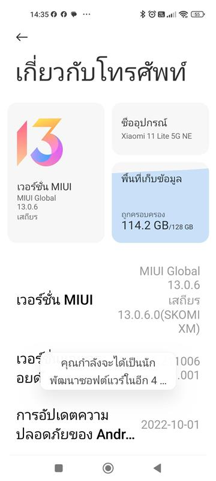
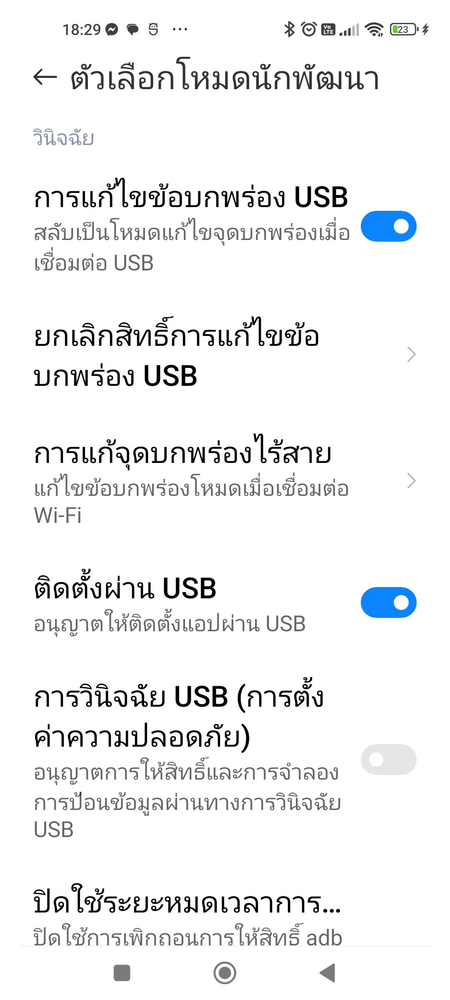
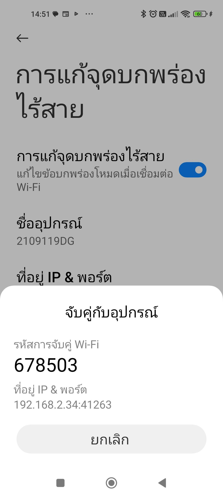
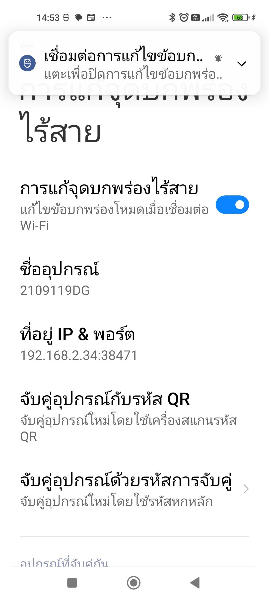

# ใช้งาน Flutter บน DevContainer
การติดตั้ง Flutter และอัปเกรดทำค่อนข้างซับซ้อนและกินเวลานาน มักจะเจอปัญหาที่นักพัฒนาเวอร์ชั่นของคอมโปเน้นต่างกัน เราสามารถใช้ 
[DevContainer](https://code.visualstudio.com/docs/devcontainers/containers) เพื่อแก้ปัญหานี้ได้

สร้างโฟลเดอร์เช่น my_flutter ที่มีโฟลเดอร์และไฟล์ .devcontainer/devcontainer.json แล้วใช้ VSCode เปิดโฟลเดอร์ my_flutter แล้ว กด CTL+Shift+p เลือก 
"Remote-Container: Open Folder in Container..." ไฟล์และโฟเดอร์ที่อยู่ในโฟลเดอร์ my_flutter จะแก้ไขได้ในคอนเทนเนอร์

## ตัวอย่างการใช้งาน
เราสามารถสร้างอิมเมจเองหรือใช้ที่มีคนสร้างมาให้ก็ได้
- แบบง่าย ใช้อิมเมจที่มีทำไว้อยู่แล้ว 
[cirruslabs/flutter](https://github.com/cirruslabs/docker-images-flutter/pkgs/container/flutter) 

```json
{
    "name": "Flutter",
    "image": "ghcr.io/cirruslabs/flutter:stable",
    "customizations": {
        "vscode": {
            "extensions": [
                "dart-code.dart-code",
                "dart-code.flutter"
            ]
        }
    }
}
```
- สร้างอิมเมจเอง อาจจะนำตัวเดิมมาเพิ่มโปรแกรมเข้าไป Dockerfile จะเป็นดังนี้
```
FROM ghcr.io/cirruslabs/flutter:3.35.6
```
devcontainer.json จะเซ็ตให้ใช้ build image และรันคำสั่ง Docker และมีการ mount USB (ยังไม่ได้ทดสอบ)
```json
{
    "name": "Flutter Development Container",
    "build": {
        "dockerfile": "Dockerfile"
    },
    "runArgs": [
        "--privileged",
        "-v",
        "/dev/bus/usb:/dev/bus/usb"
    ],
    "forwardPorts": [8081, 5037],
    "remoteUser": "root"
}
```
- สร้างอิมเมจเองและติดตั้งโปรแกรมใหม่หมด เรียกใช้ผ่าน compose.yaml
ตัวอย่างนี้ไม่ได้ mount usb ต้องรันผ่าน Wifi
  - [./devcontainer/devcontainer.json](./.devcontainer/devcontainer.json)
  - [./devcontainer/compose.yaml](./devcontainer/compose.yaml)
  - [./devcontainer/Dockerfile](./devcontainer/Dockerfile)
  - [./devcontainer/.env](././devcontainer/.env.example)


## การตั้งค่าสำหรับ Android
การตั้งโหมดนักพัฒนาภาพตัวอย่างเป็นของ Xiaomi ภาพจะเป็น Interface ไทยแต่คำอธิบายจะเป็นภาษาอังกฤษเพื่อให้เข้าใจวิธีการทั้งสองภาษา
-  Settings > About phone (หรือ About device) หาเลข Build กด 7 ก็จะเข้าสู่โหมดนักพัฒนา


- Settings > System > Developer options (หรือ Additional Settings > Developer options สำหรับ MIUI บางรุ่น) จากในภาพ Debug คือคำว่า "แก้ไขข้อบกพร่อง" ในภาษาไทย
- เปิดใช้ "Enable USB Debugging", "Enable Install via USB"

- เปิดใช้ "Enable Wireless Debugging" แล้วเข้าไป เลือก "Pair device with pairing code" และดู IP:Port สำหรับการ pair และโค้ด
```
adb pair 192.168.2.34:41263 678503
```


- รันคำสั่งต่อไปเพื่อเชื่อมต่อแล้วรันโปรแกรม ให้กด r เพื่อ Reload โปรแกรม
```
adb connect 192.168.2.34:38471
flutter pub get
flutter run
```


## Flutter Command
คำสั่งสำหรับ Flutter
```
flutter create --platform=android,ios,web my_app
cd my_app
flutter doctor
flutter pub outdated
flutter pub upgrade --major-versions

flutter run
flutter clean
flutter build apk

```


อ่านเพิ่ม
- [How I Built a Portable Flutter Dev Environment (No Android Studio Required)](https://medium.com/@bastlaca/how-i-built-a-portable-flutter-dev-environment-no-android-studio-required-f4908477180b)
