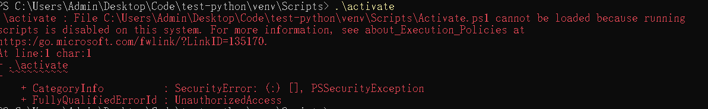
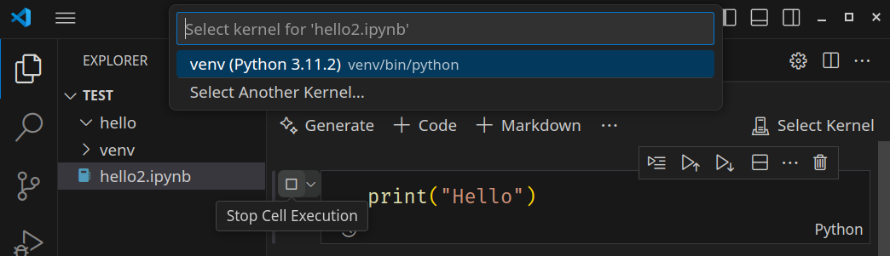
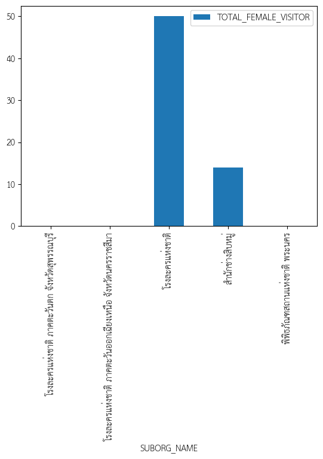

# Python

เป็นภาษาที่นิยมสอนในชั้นเรียนเนื่องจากใช้งานง่าย มี Jupyter Notebook เหมาะกับการเรียนรู้เป็นขั้นตอน Library มีให้เลือกใช้มากมาย มีบริการ on-line ไม่ต้องติดตั้งและมี GPU ให้ใช้ฟรี(แบบจำกัด) เช่น [Colab](https://colab.research.google.com),
[Kaggle](https://www.kaggle.com)

## Install

สำหรับวินโดว์ 11 พิมพ์ python ที่ terminal มันจะติดตั้งผ่าน MS Store หรือ[ดาว์นโหลดมาติดตั้ง](https://www.python.org/downloads/windows/)

Linux มักติดตั้ง Python มาให้แล้ว เวอร์ชั่น 2 หยุดพัฒนาไปแล้ว บาง distro มีทั้งเวอร์ชั่น 2 และ 3 เพราะเครื่องมือบางอย่างยังจำเป็นต้องใช้เวอร์ชั่น 2 อยู่ แนะนำให้ใช้ alias ไว้ใน ~/.bashrc หรือ python-is-python3

```bash
$ python --version
Python 2.7.6
$ python3 --version
Python 3.4.3
$ which python3
/usr/bin/python3
$ alias python=/usr/bin/python3
$ python --version
Python 3.4.3
# หรือติดตั้ง (ไม่แนะนำเพราะอาจจะมีปัญหาถ้าใช้ python2 ร่วมด้วย)
$ sudo apt install python-is-python3

```

การใช้งาน ให้สร้าง Virtual Environment เพื่อติดตั้ง package ไม่ไปรบกวนกับของระบบ(global) จะได้โฟลเดอร์ venv คล้ายๆ โฟลเดอร์ node_modules ต้องเรียกคำสั่ง activate เพื่อเซ็ตตัวแปรแวดล้อม วินโดว์และ Linux เรียกต่างกัน

```sh
mkdir hello_world
cd hello_world
python -m venv venv
# Linux
source ./venv/bin/activate
# Windows
venv\Scripts\activate
code .
```

สำหรับ Windows ถ้าเรียกผ่าน Power Shell อาจจะมีปัญหาเรื่องสิทธิ์การรันสคริปต์

ให้ใช้คำสั่งนี้ผ่าน Terminal(Power Shell)

```
Set-ExecutionPolicy Unrestricted -Force
```

**UV**

```sh
# หรือ brew install uv
$ curl -LsSf https://astral.sh/uv/install.sh | sudo sh
uv init uv-project
cd uv-project
```

```powershell
$ powershell -ExecutionPolicy ByPass -c "irm https://astral.sh/uv/install.ps1 | iex"

```

### GPU

การใช้งาน Python กับ Computer Visualization หรือ AI ควรมี GPU ช่วย
แนะนำการ์ดจอของ Nvidia เพราะ Library ทุกตัวรองรับ CUDA
ควรติดตั้งไดร์เวอร์ที่มาจาก Nvidia โดยตรง ตรวจสอบด้วยคำสั่ง

```
nvidia-smi
```

ให้ติดตั้ง [CUDA Toolkit](https://developer.nvidia.com/cuda-downloads) ด้วย

## ใช้งานผ่าน Command Line

สร้างไฟล์ hello.py

```python
#!/usr/bin/env python3
print("Hello, World!")
```

รันโปรแกรม

```sh
$ chmod +x hello.py
$ ./hello.py
Hello, World!  0
Hello, World!  1
Hello, World!  2
```

## ใช้งานบน VS Code

มีวิธีการใช้งานอีกวิธีคือผ่าน Jupyter Notebook ง่ายต่อการใช้งานไม่ต้องใช้ command line ลักษณะเหมือนกับการใช้บน Colab หรือ Kaggle

- สร้าง Virtual Environment แล้วเรียกใช้ VS Code ดังตัวอย่างหัวข้อ Install
- CTL+Shift+p เลือก "Create: New Jupyter Notebook"
- เขียนโปรแกรมเลยในช่องใส่ข้อความจะมีแบบ Code และ Markdown ให้เลือกแบบ Code และใช้ภาษา Python
- กดปุ่ม Play(ในภาพ จากรูปสามเหลี่ยมกลายเป็นรูปสี่เหลี่ยม) ครั้งแรกจะถามหา environment เลือก venv ที่สร้างไว้ก่อนหน้า จะให้ติดตั้ง package เพิ่มให้ตอบตกลง
  
- ถ้าเรียกใช้งานสำเร็จจะเห็นผลของโปรแกรม

ตัวอย่างโปรแกรมอย่างง่ายใช้ function , if/else, for ภาษา Python จะไม่ใช้วงเล็บเพื่อกำหนดขอบเขตของโค้ด จะใช้การย่อหน้าเพื่อแสดงว่าอยู่ในขอบเขตเดียวกัน

```python
def my_hello( text ):
  if text=='Banana':
    print("Hi "+text)
  else:
    print("Hello "+text)

fruits = ["Apple","Banana","Orange"]
for fruit in fruits:
  my_hello(fruit)

```

ตัวอย่าง string, dictionary, list และเขียนลงไฟล์

```python
import json
cat = '{"name":"Mew","age":20,"food":["fish","mouse"]}'
cat_dict = json.loads(cat)
print(cat_dict['name'])    # dictionary value
print(cat_dict['food'][0]) # List value
cat_str = json.dumps(cat_dict)
print(type(cat_dict))        # dict
print(type(cat_dict['food']))# list
print(type(cat_str))        # str
with open('./cat.json','w') as json_file:
  json.dump(cat_dict,json_file)

```

## Google Colab

ใช้งานเป็น Jupyter Notebook รองรับรันไทม GPU รุ่นฟรีไม่สามารถใช้งานต่อเนื่องเป็นระยะเวลานานได้ ไฟล์ที่ใช้จะหายไปเมื่อปิด Session

## ไฟล์ตัวอย่าง

มีไฟล์ตัวอย่างให้ใช้ ตัวอย่างเปิดไฟล์ สามารถคลิ้กขวาที่ไฟล์แล้วเลือก "คัดลอกเส้นทาง" เพื่อก็อป path ของไฟล์นั้นๆมาใช้

```python
with open('/content/sample_data/anscombe.json') as f:
  data = json.load(f)
  print(data)
  print(type(data)) # list of dictionary
```

ควรเก็บไฟล์ไว้ใน Google Drive ตัวอย่างนี้ใช้ไลบารี pandas อ่าน csv xlsx จาก Google Drive ทำการ mount ไดร์โดยคลิ้กที่ไอคอนรูป Google Drive หรือเรียก drive.mount('/content/drive')

```python
from google.colab import drive
drive.mount('/content/drive')
import pandas as pd
df_csv = pd.read_csv('/content/drive/MyDrive/dataset/iris.csv')
df_csv.head()
df_excel = pd.read_excel('/content/drive/MyDrive/test.xlsx',sheet_name=0)
df_excel
```

ถ้ามี Error ให้กด Explain Error สามารใช้ Gemini ช่วยแก้ให้ได้

### Google AI Studio

- สร้างโปรเจ็กที่
  [Google Developer Console](https://console.developers.google.com/project)
- ไปที่ [API Key](https://aistudio.google.com/app/apikey) ของ Google AI Studio สร้าง API Key
- ที่ colab กดรูปกุญแจเพื่อสร้าง secret ชื่อ google_api_key แล้วเอา API Key เปิดให้ notebook เข้าถึงได้
- โค้ดสำหรับใช้งานเป็นดังด้านล่าง

```python
from google.colab import userdata
api_key = userdata.get('google_api_key')
from google import genai
client = genai.Client(api_key=api_key)
response = client.models.generate_content(
    model="gemini-2.0-flash", contents="หนึ่งบวกสองได้เท่าไหร่"
)
print(response.text)
```

### Open Goverment Data of Thailand

ตัวอย่างการนำข้อมูลมาทำ Virtualize จะใช้
ฐานข้อมูลเปิดภาครัฐนักพัฒนาสามารถเรียกใช้ผ่าน [API](https://data.go.th/pages/data-go-th-api) ได้ ดู [open_goverment_data.ipynb](./open_goverment_data.ipynb)

- ไปที่ [Open Goverment Data of Thailand](https://data.go.th/) กดเลือก [สำหรับนักพัฒนา](https://opend.data.go.th/register_api/)
- สมัครเป็นผู้ใช้ยืนยันอีเมลล์จะได้ User Token ออกมา
- เอาไปใส่ใน secret ชื่อ opend_data
- กลับไปที่หน้าเวปเลือกชุดข้อมูล รูปแบบเป็น API ใช้ ["สถิติผู้เข้าใช้/เข้าชมหน่วนงานกรมศิลปากร"](https://data.go.th/dataset/mis_fad001) เป็นตัวอย่าง
- โค้ดดึงข้อมูลผ่าน API ทำการจัดรูปเพื่อแสดงผลบนหน้าจอ

```python
import requests
import json
resource_id="c2a299e0-1270-4d7f-903a-739e7f2eeb75"
url = "https://opend.data.go.th/get-ckan/datastore_search?resource_id="+resource_id+"&limit=5"

header = {
    'api-key': userdata.get('opend_data')
}
response = requests.request("GET",url,headers=header)
json_data = json.loads(response.text)
formated_data = json.dumps(json_data, indent=2)
print(formated_data)
```

- ใช้ pandas ทำออกมาเป็นตาราง

```python
import pandas as pd
df = pd.DataFrame(json_data["result"]["records"])
df[["ORG_NAME","SUBORG_NAME","TOTAL_MALE_VISITOR","TOTAL_FEMALE_VISITOR"]]
```

- matplotlib ไม่รองรับฟอนต์ภาษาไทยให้ติดตั้งฟอนต์ TH Sarabun New วิธีการมาจาก[ที่นี้](https://medium.com/@dear-pinpinut/solving-the-thai-font-display-issue-in-matplotlib-on-google-colab-7604accd963a)

```python
!wget https://github.com/Phonbopit/sarabun-webfont/raw/master/fonts/thsarabunnew-webfont.ttf
import matplotlib as mpl
mpl.font_manager.fontManager.addfont('thsarabunnew-webfont.ttf')
mpl.rc('font', family='TH Sarabun New') # Setting the default
```

- เปลี่ยนค่า TOTAL_FEMALE_VISITOR ให้เป็นตัวเลขก่อนที่จะไปทำกราฟ

```python
import matplotlib.pyplot as plt
# errors='coerce' converts non-numeric values to NaN
df['TOTAL_FEMALE_VISITOR'] = pd.to_numeric(df['TOTAL_FEMALE_VISITOR'], errors='coerce')
df.plot(x = 'SUBORG_NAME', y = 'TOTAL_FEMALE_VISITOR', kind='bar')
plt.show()
```

- ผลของกราฟ



## Titanic Dataset

ตัวอย่าง Dataset เป็นรายชื่อผู้โดยสารของเรื่อไททานิก สามารถใช้เพื่อวิเคราะห์ว่าผู้รอดหรือเสียขีวิตมีคุณสมบัติใดเกี่ยวข้อบ้าง เช่น อายุ เพศ ชนิดของตั๋ว
ดูโค้ดที่ไฟล์ 
[titanic.ipynb](./titanic.ipynb)


## อ่านเพิ่มเติม

- [Python Tutorial](https://www.w3schools.com/python/default.asp)
- [Pandas Tutorial](https://www.w3schools.com/python/pandas/default.asp)
- [Matplotlib Tutorial](https://www.w3schools.com/python/matplotlib_intro.asp)
