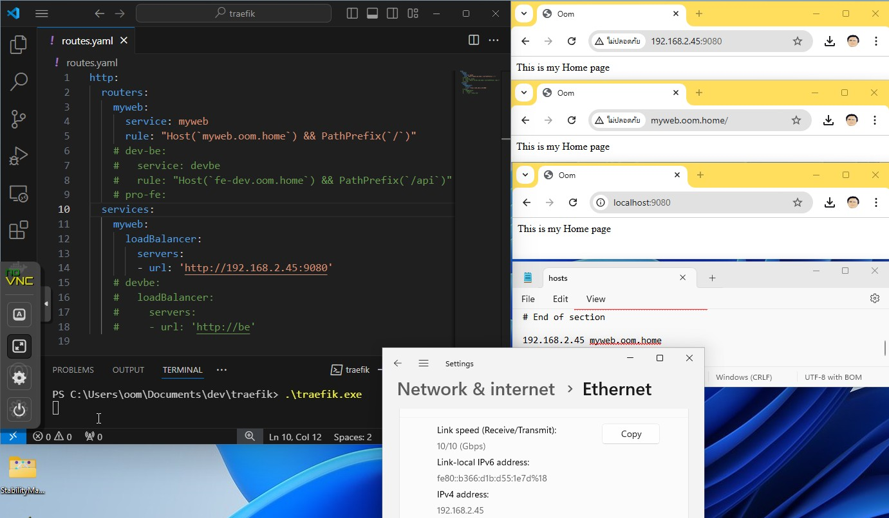

# Reverse Proxy
การจัดการเน็ตเวิร์กจะพบคำว่า Load Balancer, Reverse Proxy, API Gateway
ความสามารถค่อนข้างคาบเกี่ยวกันในหลายๆด้าน แต่จะไม่พูดในหัวข้อนี้ 
แนะนำให้อ่านบทความ
["Load Balancer vs Reverse Proxy vs API Gateway"](https://medium.com/codenx/load-balancer-vs-reverse-proxy-vs-api-gateway-fcb79912abbf)


ในปัจจุบัน IPv4 มีจำนวนจำกัด ดังนั้นหนึ่ง Public IP จะให้บริการหลายโดเมน เช่น a.com b.com และ c.com 
เวปเซิร์ฟเวอร์(Apache, Nginx ฯลฯ) รองรับความสามารถนี้ ซึ่งจะคล้ายๆกับการทำ Virtual Host

การเชื่อมโยงโดเมนเข้ากับ IP Address จะอาศัย DNS(Domain Name Service) หรือไฟล์ hosts ซึ่งในแต่ละระบบปฎิบัติการจะเป็นดังนี้
- Linux : /etc/hosts
- Windows : C:\Windows\System32\drivers\etc\hosts
- [macOS](https://kb.hostatom.com/content/3464/) : /private/etc/hosts

เมื่อหลายโดเมนชี้มาที่ IP Address เดียวกัน Reverse Proxy ทำหน้าที่ส่งต่อไปยังเซิร์ฟเวอร์ที่อยู่เบื้องหลัง


[(ภาพจาก cloudflare)](https://www.cloudflare.com/learning/cdn/glossary/reverse-proxy/)

จากภาพด้านซ้ายเป็นเครื่องผู้ใช้งาน Reverse Proxy(มี Public IP) จะเป็นช่องทางเดียวที่ยูสเซอร์บนอินเตอร์เน็ตมองเห็น และด้านขวาเซิร์ฟเวอร์จะอยู่ในเน็ตเวิร์กภายในไม่สามารถติดต่อได้โดยตรง ต้องผ่าน Reverse proxy เท่านั้น Reverse Proxy จะอาศัยชื่อโดเมนที่ทางซ้าย request มา เทียบกันค่าที่ตั้งไว้เพื่อส่งต่อให้เซิร์ฟเวอร์ภายในได้ถูกต้อง ให้ดูวีดีโอติดตั้ง Nginx Proxy Manager เพื่อทำ Reverse Proxy

[](https://youtu.be/iWrbL-xDwlk "Nginx Proxy Manager ตอนติดตั้งและใช้งานเบื้องต้น")

```yaml
services:
  npm:
    image: 'jc21/nginx-proxy-manager:latest'
    restart: unless-stopped
    ports:
      - '80:80'
      - '81:81'
      - '443:443'
    volumes:
      - ./data:/data
      - ./letsencrypt:/etc/letsencrypt
```
เวลา NPM ทำการ proxy ไปเวปเซิร์ฟเวอร์ที่อยู่ในแต่ละคอนเทนเนอร์ ห้ามใช้ localhost เพราะ ตัว NPM เองก็เป็นคอนเทนเนอร์เหมือนกันซึ่งจะหมายถึงตัว NPM เอง กรณีเวปเซิร์ฟเวอร์เปิดพอร์ตบนเครื่องโอสให้ใช้ IP address ของโฮสแทน หรืออ้างโดเมน host.docker.internal


## HTTPS
เนื่องจาก Reverse Proxy เป็นจุดรวมในการเชื่อมต่อจากอินเตอร์เน็ต จึงเหมาะกับ ทำ HTTPS เพื่อให้มีการเข้ารหัส ซึ่งจะต้องมี Certificate อาจจะซื้อมาใช้ ขอฟรีจาก Let's Encrypt หรือ ทำขึ้นมาเองซึ่งเรียกว่า Selfsigned Certificate ตัวอย่างคำสั่งด้านล่างจะทำ wildcard Certificate ทำให้ Certificate ตัวเดียวใช้ได้หลาย Sub Domain เวลาใช้งาน ให้ไปติดตั้งใน reverse proxy

```
# create oomhome.crt oom.home.key
openssl req -x509 -newkey rsa:4096 -sha256 -days 3650 \
  -nodes -keyout oom.home.key -out oom.home.crt -subj "/CN=oom.home" \
  -addext "subjectAltName=DNS:oom.home,DNS:*.oom.home"
```

Selfsigned Certificate  จะยังไม่ได้ถูกยอมรับโดยระบบปฎิบัติการหรือบราวเซอร์ เวลาใช้งานจะขึ้นว่าไม่ปลอดภัยอยู่ดี แต่การสื่อสารถือว่ามีการเข้ารหัสเรียบร้อยแล้ว ถ้าจะให้ Chrome ไม่ขึ้นเตือนต้อง import certificate [ตามวิธีในเวปนี้](https://github.com/BenMorel/dev-certificates)

ในวีดีโอจะใช้อีกวิธีคือสร้าง root CA ขึ้นมาก่อนแล้วทำการ sign certificate อีกที ถ้า chrome ติดตั้ง root CA แล้ว certificate ที่ sign ด้วย root CA นี้ก็จะถูกเชื่อถือไปด้วย

[](https://www.youtube.com/watch?v=pyJF2DnPv7Y "Nginx Proxy Manager สร้าง Self-signed certificate ใช้เอง")


## แบบฝึกหัด
- สร้าง Wildcard Certificate สำหรับทำ HTTPS
- ใช้ Docker เปิดใช้งานเวปเซิร์ฟเวอร์หรือเวปแอปขึ้นมา 2-3 เวป
- สร้างโดเมนต่างๆกัน สำหรับเวปแอปโดยระบุในไฟล์ hosts
- ใช้ Nginx Proxy Manager เพื่อเชื่อมโยงโดเมนกับเวปที่ทำไว้ ติดตั้ง certificate เพื่อให้ใช้งาน https
- นำเข้า Certificate ให้ในแต่ละเครื่อง เพื่อให้แสดงว่าปลอดภัยบน browser


# API Gateway

API Gateway มีความสามารถทั่วไปเหมือน Load Balancer และ Reverse Proxy
แต่จะออกแบบมาโดยเฉพาะเพื่อจัดการ API สามารถใช้กับระบบที่เป็น Frontend กับ Backend(API) ทั่วไป จนไปถึง Microserice มีให้เลือกหลายตัว บทเรียนนี้จะเลือกมาใช้เพียงสองตัวนี้เพราะใช้งานง่ายไม่มีค่าใช้จ่าย
- [Traefik](https://traefik.io/traefik/) ผมใช้ development หรือ Production ขนาดเล็ก เพราะขนาดเล็กและเร็ว
- [APISIX](https://apisix.apache.org/) ผมใช้ใน Production เพราะฟีเจอร์เหมาะกับงานหลากหลายรูปแบบ

ตั้งค่า /etc/host ให้ชี้ไปที่ IP ของเครื่องที่ใช้พัฒนาโปรแกรม
```
...
192.168.2.101 fe.oom.home fe-dev.oom.home tf.oom.home
```

## Traefik
มีรุ่น enterprise เสียเงินมีความสามารถมากขึ้น แต่รุ่นฟรีก็เพียงพอกับการใช้งานทั่วไประดับ Production แล้ว traefik
มีความยืดหยุ่นสูงมาก สามารถคอนฟิกได้หลายแบบ ใช้ผสมกันได้บางครั้งอาจทำเกิดการสับสนได้ เพราะตั้งค่าที่ต่างกันแต่ให้ผลเหมือนกัน ในตัวอย่างจะใช้ การรันโปรแกรม(binary) กับรันบน docker แบบฝึกหัดนี้จะใช้โค้ดจากโปรเจ็กที่เคยทำแล้ว [express-ts](../express-ts/) และ [sveltekit-fe-ts](../sveltekit-fe-ts/)

### Treaefik Binary
ใช้ simpleweb มาทดสอบ ให้หยุดการทำงาน Nginx Proxy Manager มาทดสอบ เพื่อให้port 80 ว่าง 
- สามารถเข้าหน้านี้ได้จาก Chrome http://192.168.2.45:9080
- ให้ดาว์นโหลดโปรแกรม [traefik](https://github.com/traefik/traefik/releases) พร้อม uncompress จะได้ไฟล์ traefik.exe
- สร้างโฟลเดอร์ traefik แล้วใส่ไฟล์ traefik.exe แล้วสร้างไฟล์ [traefik.yaml](traefik/traefik.yaml) และ [routes.yaml](traefik/routes.yaml) 
- เรียกใช้งาน ./traefik.exe



Linux หรือ macOS ดาว์นโหลดมาใช้งานแบบนี้
```sh
mkdir traefik
cd traefik 
# put traefik.yaml and routes.yaml here
wget https://github.com/traefik/traefik/releases/download/v3.2.0-rc2/traefik_v3.2.0-rc2_linux_amd64.tar.gz
tar -xzf *.tar.gz
traefik
chmod +x traefik
./traefik
```

### Treaefik Docker
จำลองระบบ Test/Production โดยที่โปรแกรมทุกตัวรันบน Docker ทั้งหมด ให้หยุดการทำงานของโปรแกรมก่อนหน้านี้ สร้าง docker network
```sh
 docker network create proxy
```
ให้เรียก "npm run build:docker" และ "docker compose up -d" ที่ express-ts(localhost:4001) และ sveltekit-fe-ts(localhost:3001) 
ในโฟลเดอร์ traefik ให้เรียก "docker compose up -d" เพื่อใช้ traefik ผ่าน [compose.yaml](./traefik/compose.yaml) 
- [ดูการใช้งานแบบโปรแกรมเพิ่มเติม](https://github.com/schooltechx/youtube/tree/main/traefik/traefik-intro)

## APISIX


