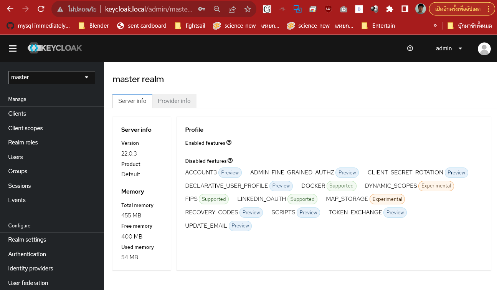
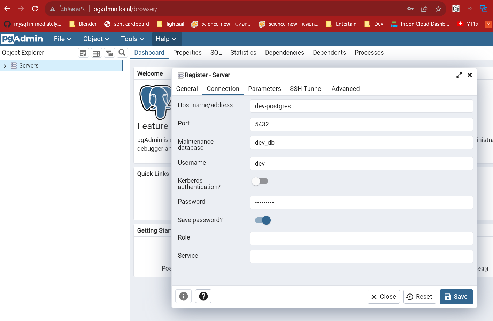
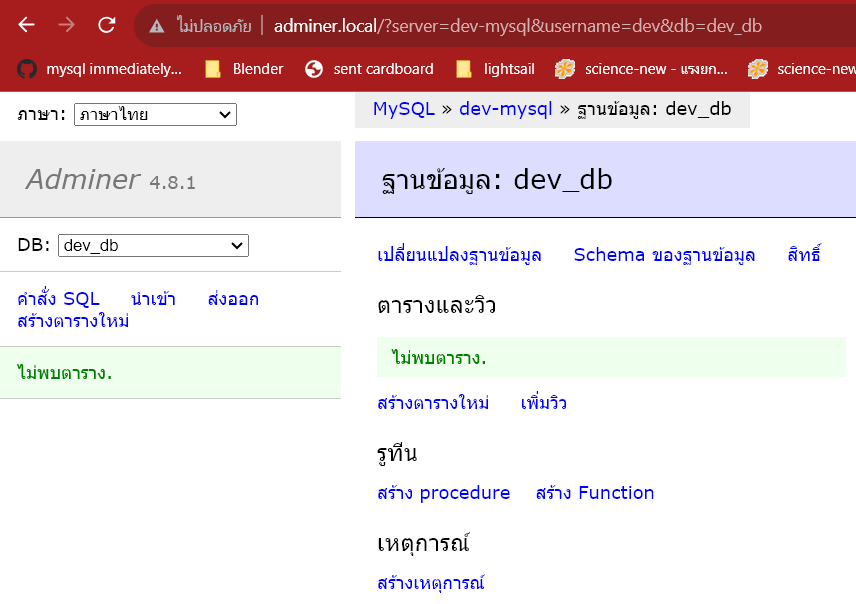
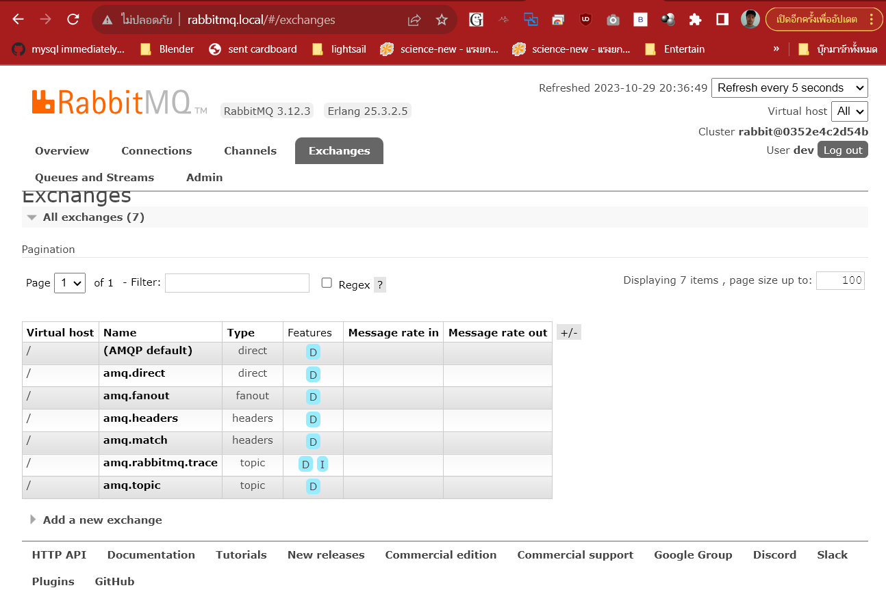

# development service

บริการต่างๆสำหรับการพัฒนาโปรแกรม พยายามจะรันแบบ minimal ให้ดูรายละเอียดใน [compose.yaml](./compose.yaml) จะเก็บข้อมูลของแต่ละบริการไว้ใน volume เพราะประสิทธิ์ภาพดีกว่าบน filesystem 

``` bash
# ควรเลือกรันเฉพาะบริการที่ใช้
docker compose up -d dev-traefik dev-keycloak dev-minio
# หยุดบริการ keycloak 
docker compose stop dev-keycloak
# ลบ container
docker compose down dev-minio
# แสดง volume
docker volume ls
# ลบ volume
docker volume rm service-dev_dev_minio_data
```

## Domain
แก้ไฟล์ host ในเครื่อง เพื่อ resolve domain ได้ที่เครื่องควรทำทั้ง วินโดว์ และ Linux
```
192.168.2.100 app.local dev.local traefik.local keycloak.local minio.local rabbitmq.local pgadmin.local adminer.local
```
Reverse Proxy ทำให้สามารถเข้าใช้ URL เหล่านี้ได้
- http://app.local 
- http://keycloak.local
- http://minio.local
- http://minio.local/console/login
- http://rabbitmq.local 
- http://pgadmin.local 
- http://adminer.local

## API Gateway 
สำหรับนักพัฒนาจะใช้ http://app.local ,http://dev.local Traefik จะ Route ตาม Rule ใน label ที่อยู่ใน [compose.yaml](./compose.yaml) และไฟล์ [routes.yaml](./routes.yaml) ทุกบริการจะใช้เน็ตเวิร์ก dev เพื่อจะได้อยู่ในเน็ตเวิร์ดเดียวกัน

## Identity Server
ใช้ Keycloak ให้อ่านในเอก[สารนี้](./keycloak/) 



## Database
ใช้ PostgreSQL, MySQL ใส่ health check เผื่อ Web App ต้องการให้ฐานข้อมูลพร้อมใช้ก่อนเชื่อมต่อ PostgreSQL จะมี pgadmin เป็นเวป client



MySQL จะมี adminer เป็นเวป client


## Message Queue  
ใช้ RabbitMQ จะมีเวป client ให้เข้าดูได้


คอนฟิกเพิ่มเติม[ดูที่นี้](https://elnatantorres.medium.com/configuring-rabbitmq-on-its-startup-with-docker-d219af4b751a)

- [RabbitMQ OAuth2 Tutorial](https://github.com/rabbitmq/rabbitmq-oauth2-tutorial/tree/main)

## Search Service
ใช้ Elasticsearch Kibana

## อ่านเพิ่ม
- MiniO: น่าจะลองเอาฟีเจอร์[Versioning, Metadata ](https://blog.min.io/minio-versioning-metadata-deep-dive/) มาใช้ให้เป็นประโยชน์
- MiniO: น่าจะหาโซลูชั่นสำหรับการ backup มาเก็บใน MiniO
- [MinIO Authentication and Authorization Using OpenID and Keycloak](https://www.youtube.com/watch?v=mv8I1wvTCrE)
[Secure Real-Time WebSockets With RabbitMQ](http://www.kevinmusselman.com/2019/10/21/real-time-websockets-using-rabbitmq/)
