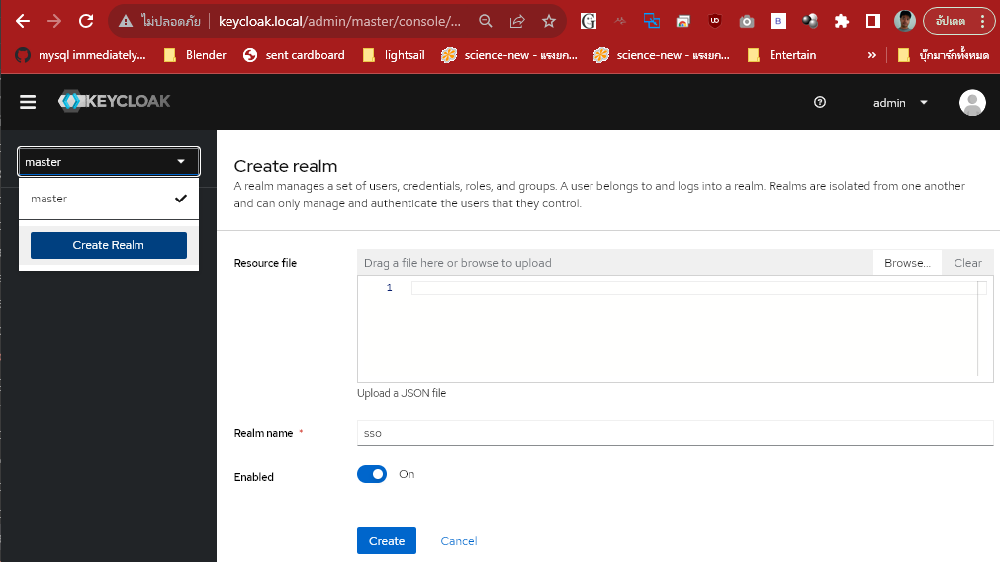
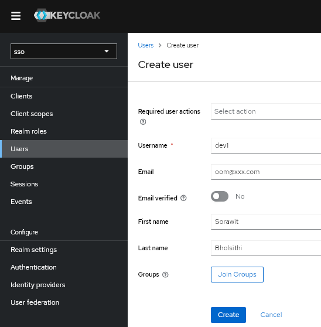
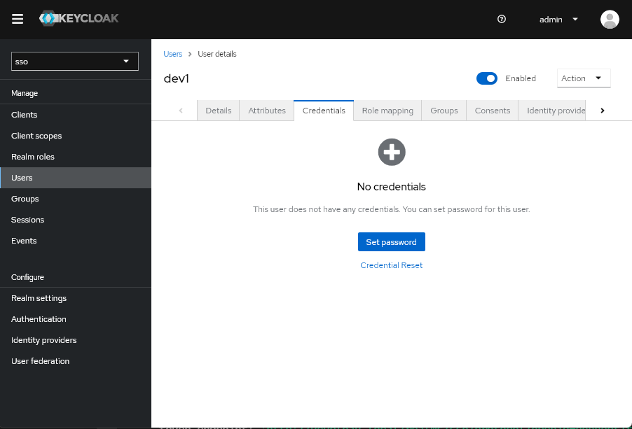
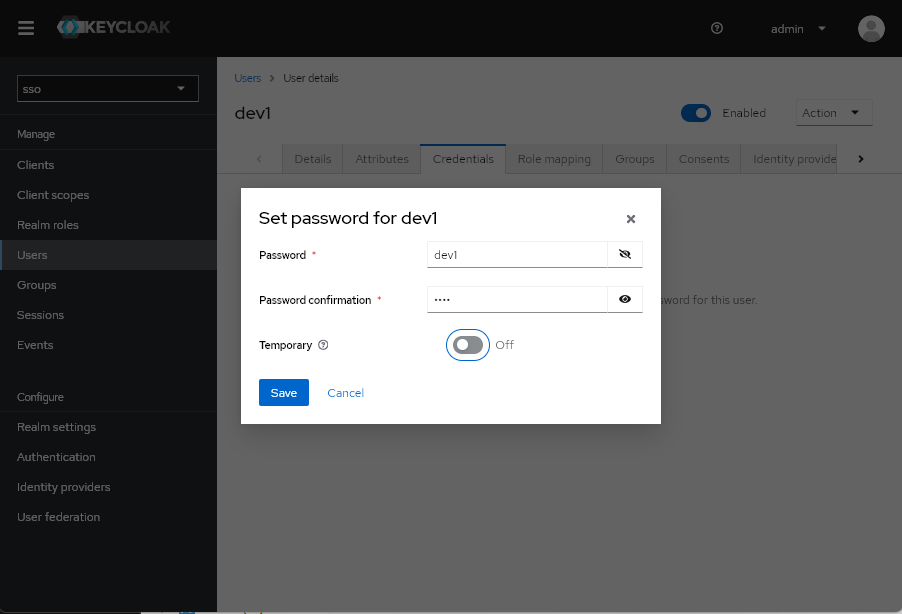
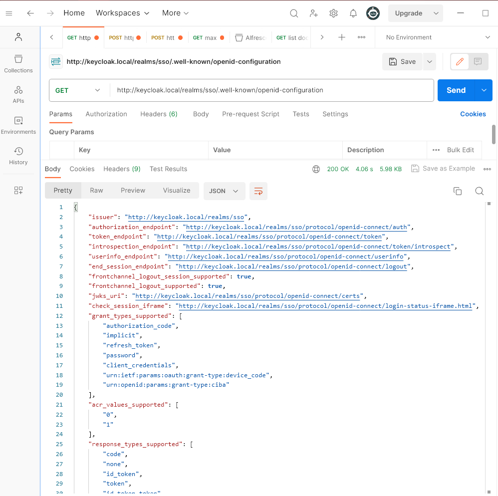
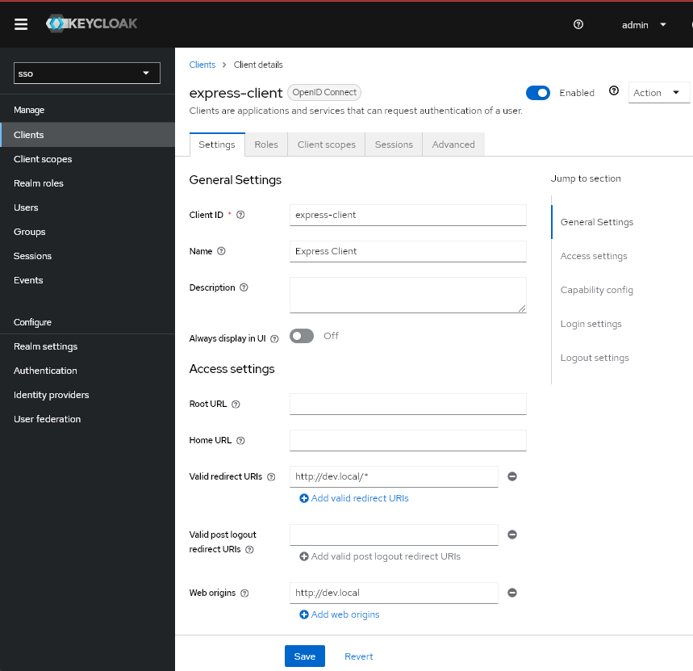
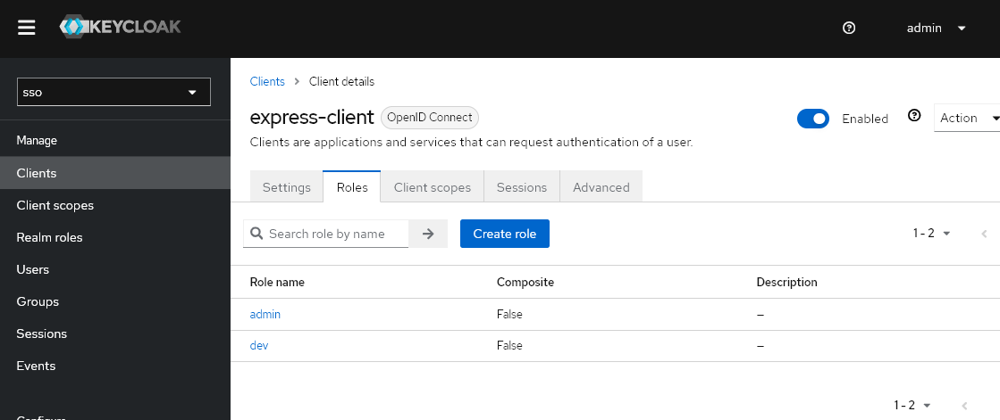
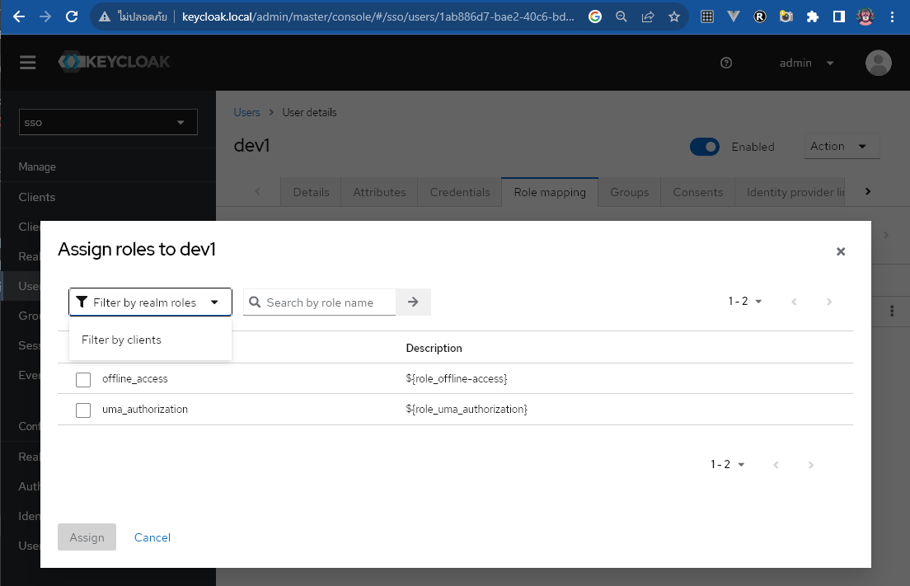
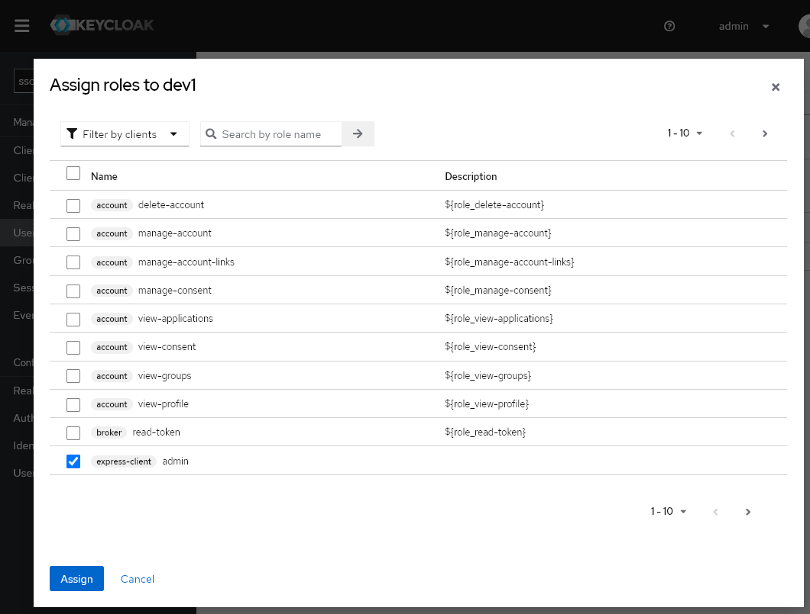
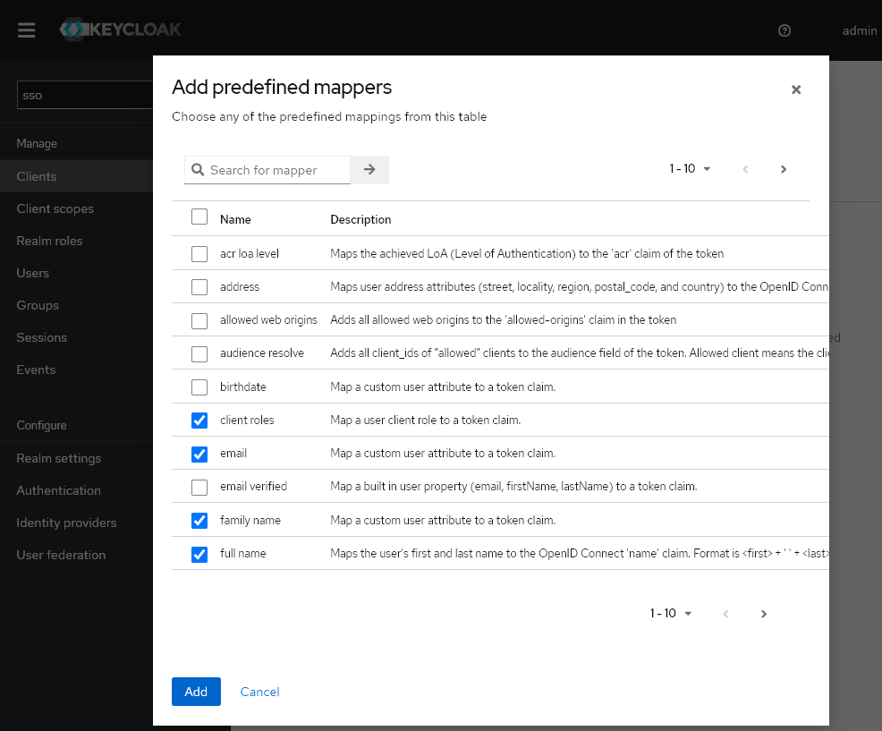

# Keycloak

เอกสารนี้จะมี ขั้นตอนการตั้งค่าสำหรับการพัฒนา

มี shell script [keycloak-curl.sh](./keycloak-curl.sh) สำหรับดึงค่า access token ออกมาใช้งาน ดัดแปลงมาจาก[ที่นี้](https://github.com/akoserwal/keycloak-integrations/blob/master/curl-post-request/keycloak-curl.sh)

```bash
# keycloak-curl.sh keycloak_domain REALMS USER CLIENT_ID VERIFY HTTPS
$ ./keycloak-curl.sh keycloak.local sso dev2 express-client n n
Using Keycloak: http://keycloak.local/realms/sso/protocol/openid-connect/token
realm: sso
client-id: express-client
username: dev2
secure: n
Password:  % Total    % Received % Xferd  Average Speed   Time    Time     Time  Current
                                 Dload  Upload   Total   Spent    Left  Speed
100  2551  100  2479  100    72  41867   1215 --:--:-- --:--:-- --:--:-- 43237
eyJhbGciOiJSUzI1NiIsInR5cCIgOiAiSldUIiwia2lkIiA6ICJlYWoxbFM1czg0ajZyZkxrY0NQeWtzdFVJbnVEaDNxel9Ub1EtZU5zNklRIn0.eyJleHAiOjE2OTkzNjkzNzgsImlhdCI6MTY5OTM2OTA3OCwianRpIjoiYmFkOGQ5OWQtY2YxYy00MjcwLTkwZGEtYjAxOTgzODU5MjJmIiwiaXNzIjoiaHR0cDovL2tleWNsb2FrLmxvY2FsL3JlYWxtcy9zc28iLCJhdWQiOiJhY2NvdW50Iiwic3ViIjoiNjRkZmU4Y2YtZTJhZS00ZmI5LTkzYTktMzZlMGQ0Y2FkZTJiIiwidHlwIjoiQmVhcmVyIiwiYXpwIjoiZXhwcmVzcy1jbGllbnQiLCJzZXNzaW9uX3N0YXRlIjoiNjBmYmE2NDgtZmNjOC00YjQ4LTkzOWEtOTc0N2I4ZWQ0ODllIiwiYWNyIjoiMSIsImFsbG93ZWQtb3JpZ2lucyI6WyJodHRwOi8vZGV2LmxvY2FsIl0sInJlYWxtX2FjY2VzcyI6eyJyb2xlcyI6WyJvZmZsaW5lX2FjY2VzcyIsImRlZmF1bHQtcm9sZXMtc3NvIiwidW1hX2F1dGhvcml6YXRpb24iXX0sInJlc291cmNlX2FjY2VzcyI6eyJleHByZXNzLWNsaWVudCI6eyJyb2xlcyI6WyJkZXYiXX0sImFjY291bnQiOnsicm9sZXMiOlsibWFuYWdlLWFjY291bnQiLCJtYW5hZ2UtYWNjb3VudC1saW5rcyIsInZpZXctcHJvZmlsZSJdfX0sInNjb3BlIjoicHJvZmlsZSBlbWFpbCIsInNpZCI6IjYwZmJhNjQ4LWZjYzgtNGI0OC05MzlhLTk3NDdiOGVkNDg5ZSIsImVtYWlsX3ZlcmlmaWVkIjpmYWxzZSwicm9sZSI6WyJkZXYiLCJtYW5hZ2UtYWNjb3VudCIsIm1hbmFnZS1hY2NvdW50LWxpbmtzIiwidmlldy1wcm9maWxlIl0sIm5hbWUiOiJEZXZlbG9wZXIyIiwiZ3JvdXBzIjpbIm9mZmxpbmVfYWNjZXNzIiwiZGVmYXVsdC1yb2xlcy1zc28iLCJ1bWFfYXV0aG9yaXphdGlvbiJdLCJwcmVmZXJyZWRfdXNlcm5hbWUiOiJkZXYyIiwiZ2l2ZW5fbmFtZSI6IkRldmVsb3BlcjIiLCJmYW1pbHlfbmFtZSI6IiIsImVtYWlsIjoiZGV2MkB4eHguY29tIn0.XNOvPTPTKtKRxGdsO0HorFnBK7C5p8YrPo2Gl7capCTRc1jpgkt6hsoQ4ifGL1c3DBRLYvBB_g7rY7t7caMEtVL6WMZwhaRoQ3L88gmds1Iu0YVFaYJWeSlTkSRdS3JoGzYJdFXOi7DOXe81nrpD0__8Uj3-88s0eCvPtpTYQ2XqqA4WECutgr9aTBPIoXaAIQD2rqf4h5uUBrVJIT-eD5iTykUackas1WsVRaSP0cjTvqibnzN9w6Z7-rb1teVyph6bjKdxLo4bQL9aWKbBmK_L0buFME6nvDAyVF4dFkIdXmiM9VV951QGyJdpcEixArhmcTPOirwczIONvVcRwQ
```

## สร้าง Realm 
ชื่อ sso แล้ว สร้างยูสเซอร์สำหรับทำการทดสอบ

http://keycloak.local/realms/sso/.well-known/openid-configuration
- สร้างยูสเซอร์ dev1 รหัส dev1




ดูค่าคอนฟิกของ Realm ที่สร้างโดยไปที่ URL นี้

http://keycloak.local/realms/sso/.well-known/openid-configuration



## express-client
สร้าง client ชื่อ express-client แบบ Default(Authorization Code Flow) เซ็ตค่า "Valid Redirect URIs" เป็น http://dev.local/*



สร้าง Client Role ให้กับ express-client

/Clients/express-client/Roles กด "Create role" สร้าง admin, dev



ไปที่ "Users/dev1/Role mapping" กดปุ่ม "Assign role" เลือก "Filter by clients" 


เลือก "express-client admin" แล้วกดปุ่ม "Assign"



## Client scopes
เป็นการเลือกข้อมูลที่จะมาแสดงใน token
- เมนู "Clients/express-client/Client scopes/express-client-dedicated/Mappers" กดปุ่ม "Add predefined mapper" เลือกข้อมูลที่จะให้แสดงใน token ให้เลือก client role, email, family name, gender, given name, group, username กด Add



- ทำการแก้ไข client roles ให้ Token Claim Name จาก "resource_access.${client_id}.roles" เป็น "role" จะเอาค่า roles ของ express-client มาอยู่ในรูปแบบที่ .NET หรือบาง framwork สามารถใช้งานได้เลย 
``` json
{
    "role":["admin","dev"]
}
```
- เอารายการใน Client scopes ของ express-client ที่ไม่ได้ใช้ออก เพื่อลดขนาดของ token

## อ่านเพิ่ม
- [Keycloak Express Openid-client](https://dev.to/austincunningham/keycloak-express-openid-client-3mmg)
- ลองดู yotube [ช่องนี้](https://www.youtube.com/@hexadefence/videos) มีวีดีโอสอนใช้งาน
  - [Keycloak REST API with Postman](https://www.youtube.com/watch?v=lfBYdN79M9c)
  - [Keycloak NodeJS Admin Client](https://www.youtube.com/watch?v=nkvBy4wefbs) ตัวอย่างจัดการ keycloak ผ่าน keycloak-admin package (มียูสเซอร์เจ้า่ไปจัดการ)
